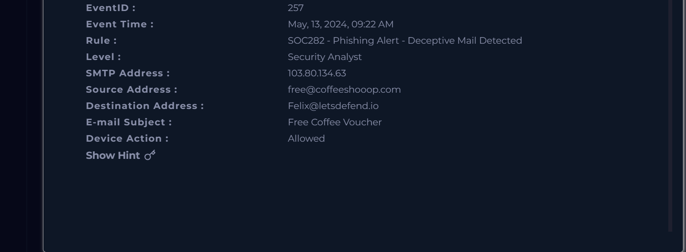

# Alert 003 – Phishing Email Detected

## Alert Source
LetsDefend SIEM

## Alert Overview
- Rule Name: SOC282 – Phishing Alert – Deceptive Mail Detected
- Severity: Medium
- Event ID: 257
- Date/Time: May 13, 2024 – 09:22 AM
- Alert Type: Phishing

## Screenshots

### Alert Overview

### Phishing Email Details

## Email Details
- Sender Email: free@coffeeshooop.com
- Recipient Email: Felix@letsdefend.io
- Email Subject: Free Coffee Voucher
- Action Taken: Allowed

## Investigation Steps
1. Reviewed phishing alert metadata in the SIEM
2. Analyzed sender email address and domain
3. Reviewed email subject for social engineering indicators
4. Checked for user interaction with the email
5. Assessed potential impact on the user account

## Findings
- Email uses a social engineering lure (free voucher)
- Sender domain appears suspicious and unrelated to a trusted brand
- Email was delivered to the user mailbox
- No evidence of credential submission or malware execution observed

## Verdict
True Positive – Phishing Attempt

## MITRE ATT&CK Mapping
- T1566.002 – Phishing: Spearphishing Link

## Recommendations
- Block the sender domain and email address
- Educate users on phishing awareness
- Review mail gateway filtering rules
- Monitor the user account for suspicious activity

## Evidence
> Note: Alert was reviewed in the Investigation Channel. Screenshot evidence was not captured at the time of investigation.
> 
